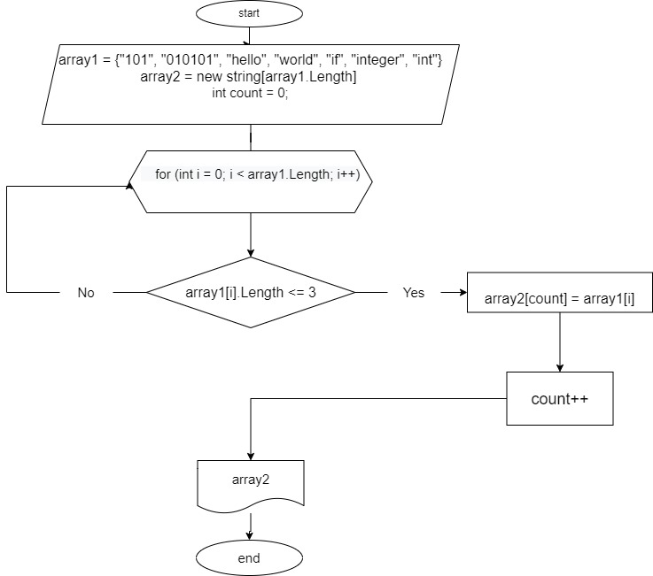

# **Задача**

Написать программу, которая из имеющегося массива строк формирует массив из строк, длина которых меньше либо равна 3 символа. Первоначальный массив можно ввести с клавиатуры, либо задать на старте выполнения алгоритма. При решение не рекомендуется пользоваться коллекциями, лучше обойтись исключительно массивами.

# Описание решения:

1. Задаем первый массив, состоящий из 7-ми элементов разной длины. Второй массив объявляем равным длине первого массива.

2. Создаём метод, перебирающий значения начального массива, с переменно-счётчиком, которую будем увеличивать при нахождении значений - удовлетворяющих поиску. Внутри счетчика проводим проверку условия ( <=3 ), если условие соблюдается, то элемент первого массива заносится в count элемент второго массива. Переменная count позволяет поочередно закидывать элементы из первого массива во второй и оформить без пробелов. После присвоения увеличивается переменная count на 1 и возвращается к циклу for в котором i увеличивается на 1. И так проверяется до конца.

3. Выводим второй массив в терминал и видим элементы, состоящие из 1, 2-х или 3-ех символов.

# Блок-схема

Ссылка на блок-схему на всякий случай 

https://viewer.diagrams.net/?tags=%7B%7D&highlight=0000ff&edit=_blank&layers=1&nav=1&title=final.drawio#R7VtJc9s2FP4tPWgmOcjDndLRsp2mM0mbqQ9teoNIiEINEiwIWVJ%2FfQEC4CpK1K64zmQs8mF%2F7%2BHDW8CB%2FRCvfqYgnX8lIcQDywhXA%2FtxYFkjb8T%2FCsJaEhzfl4SIolCSzJLwjP6Fimgo6gKFMKtVZIRghtI6MSBJAgNWowFKybJebUZwfdQURLBFeA4AblP%2FQCGbq2VZfkn%2FDFE01yOb3liWxEBXVivJ5iAkywrJfhrYD5QQJp%2Fi1QPEgneaL7Ldp47SYmIUJqxPg1%2Fo0%2FT3z6PhAn77LXkOzK%2FTv4KhLXt5BXihFqwmy9aaAzDkDFGvhLI5iUgC8FNJnVCySEIohjH4W1nnCyEpJ5qc%2BDdkbK2kCxaMcNKcxViVyjHFQJ1rU6SMLGgAtyxI6wigEWRb6lmFBLjmQhJDRte8HYUYMPRanwdQOhQV9Uo28wfF6T24bra4nvEJszbrMeZ6Lli8nCMGn1OQr33Jd9omBr5CyuBqOwvbS1YNbNeRTdRG1Wq7LLXe1LR5ReNt40xMsjaopof5qJMQvdb45P2zEJtoUnuK1G%2FeIktBsrHJjCRsmOV6ec8rmF66ypsZUxC8RLliDwOCCZXlKEEMAbxxLI42YM15bMgBQCxklEyztDIPzgg5lctPb%2BDfxCwKimmYteLrz%2BxByO4WJqIphmm8c2knl%2BYcS8g7k7YzaUkoN3zembSVSWj2zqEdHEoYjCB9Z9NONt0Wi%2FzHHbPg5NyqqlPFFPaaW5f9dUKL7UDDzDpCRw5guL2L4acc7JIrS%2BDyja4sYxQl0QUX5x4MDYc7J5ca7%2B5yQ32BScQ91AvK7aJ7ey9HcjOM74%2B%2BXS2auO924H5%2BABoBXynTDrFh9JtnnTSl%2FZbYSZVHmCY34ivZHKTiMQUUYAwxiSiIecUUUhRDxg2dRtm3smBXSGaGVlDHM8U7wChK%2BHMAE9n%2BBDEbc2TUYjZ%2BO2bj%2BGY7ZjM%2BV8zGv4lwopD5JxAjLNjyGeJXyFAAVIEWiafeH%2BRG5FOzjfxffhQAyu5F9JgXJCSBhbhOE6N0egYpvasGKdtRyjcjTC4yuv5TTSp%2F%2BS5e7lz9%2BriqFj6u1dsplcDrG6k%2BNlStmn4jEpUVdhQgoOO9VgMU5MRUq1KX7oUlUamWigpZ9zimUx%2FHdhtpih31dYC5VGU5g1KxC54cruvO3rHmTu8MowQONdiKIsvZ4RztaS7QaPrBcl3p9lYfPm6z%2FNwJ4obLnTaWjMKwwIW%2FYth7WhcNMKBzEk8X2e6j8QQnnzX273y3rlhm%2B%2FTj2nbnts%2B%2F0bnOv%2FHbgMwTwlxflBtd86jzOrd%2F2%2F7cCgjLyr5PCI2VVb8FFIzzh1KOjuKoAIo7kQa98H%2BUTV8Dl06rex%2FDvbFbzo8kntc4nyxfQ0YVSIxxG0Yc91ym1%2FgasFEaRaUd9L1mBm02inrBjXsZuBn1hBvzqngzOjfeNHf26HDrpD%2FeKHd%2Fkv%2Ff31mvLv3iKOAbzl3dnHCcnhcgvHMZE%2BZtXM452pqASdjpfu2HNCcECuu63pdjug19K%2Fwe3YlcQsv%2F6tNVM77T4cqdynsy2%2B7Td5i1dJXvTlZXrYxR8gK1zijlmCGMG6RW7Ezsda6E%2BF4VxCgMc23fhBT1HYDBFOJJ4Vk1Bz%2FNWXYUFrl%2BwyKx2%2FaId8mbWKb7VoHohIDSN6YnN8vJAcW17Tur4RC7ByKKN9ocsrkYnrT9sV%2FJO5wcCCci83JbcPJGsgS3ASfH5gi6osPt%2BNqhcHKpSHPRb89I847654k0Wz9QVuVCPrvZ12mvfDZxjXxY22vXN4sa8tNp5ZAEizhnx66I%2BFTK88tUE27%2FWLHdptvhXt1j1oNVRMRBur2%2F%2Bn5W8SNIof7Vhmf3lEHT2zydDDbl0v7fAKc5sBPgjnUNjhOctUFw3LoQebUeycpGhtKQaUn987ESl5wpsYiqVckM2nFLt54lkYNuDHa%2BAooA%2F%2BUWPGALKj4Z3FovAGlXlWpQ1VG6YGCubZAO%2BfIDcUuw1ZLQdA4S1aUlacJDGSpnQ5ArV39kGeI6nqiRDL3UvIRR3tmM969HUval2Nf5N42VYZaEhvWJFX3xtUxfEO9O9Cndo6FChlq9LZlmZ6QSzM5YZ5q1NPNeQxgQytWTJEM2R8FLArOsfa%2BtVbciy631Ou7JGTNMAGsyJ0RZisFaVxfBbv7wE4pTjiAg6UyTNa7YGRtIXBb87wdpQKJB%2FVKbJNQz6jo5plPuup4Ij3%2FsTrRX9lv52GFfzOEKcFQc1C%2BsKWpxVc3afc4176rd%2Frln%2BaNmuKOIelbTdr6zKf%2Fv73%2F48dfyU13pDJTfO9tP%2FwE%3D